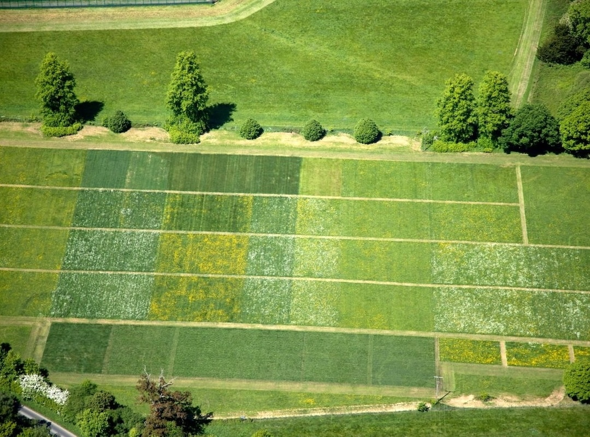
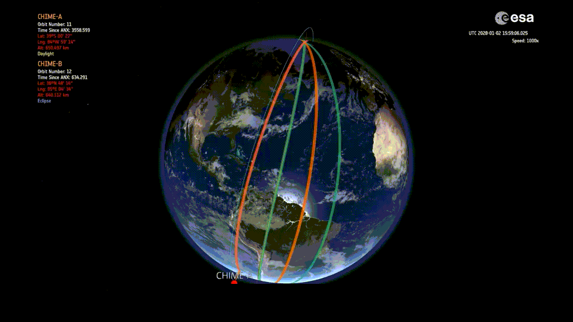
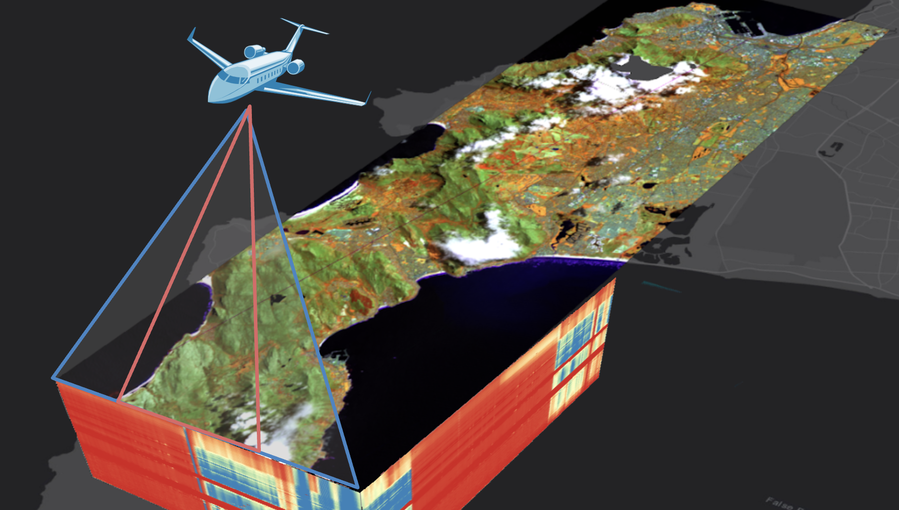
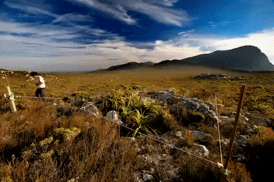
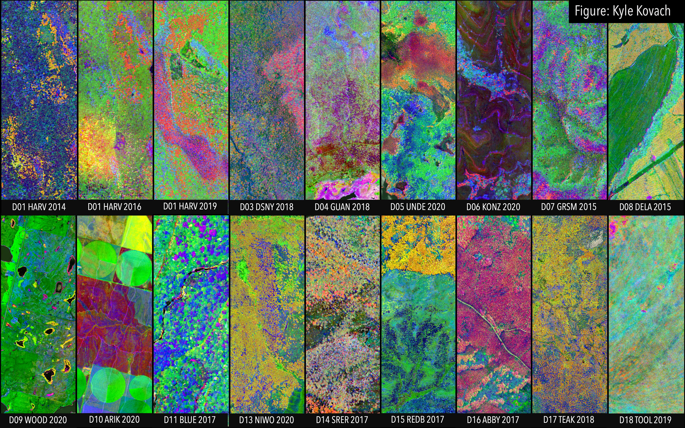
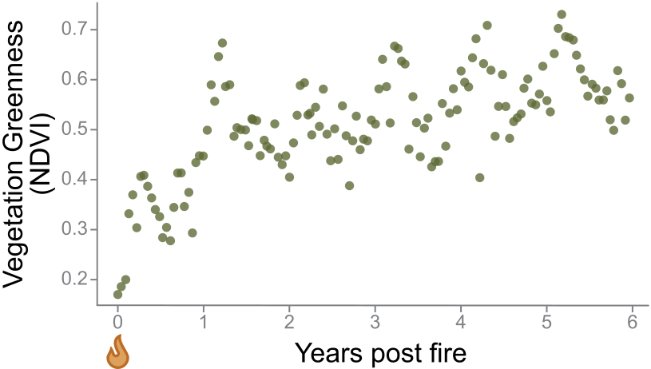
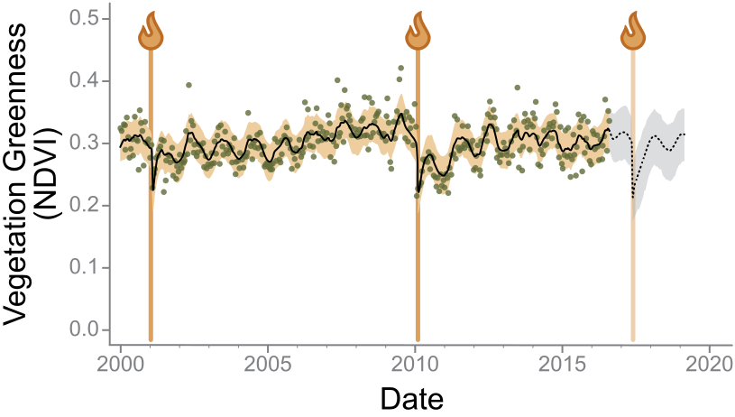
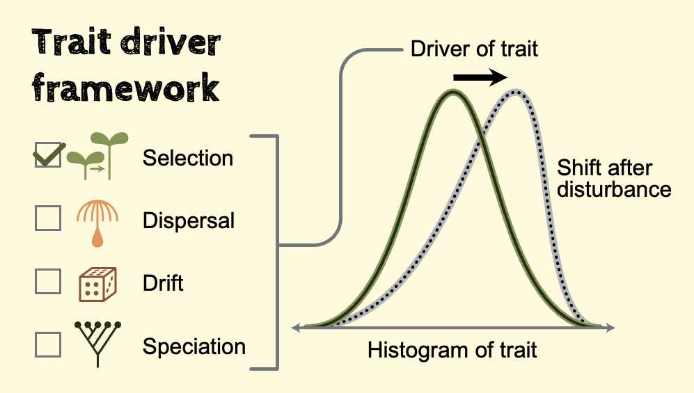
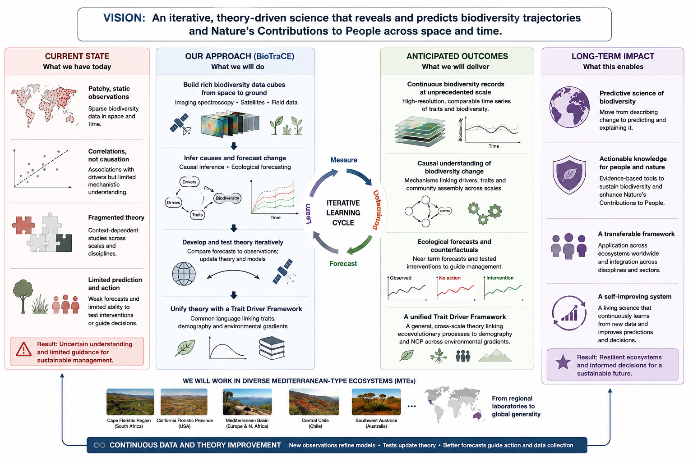

##  {.center background-image="img/NG/Drosera capensis_flower.jpg" background-size="400px" background-position="right"}

{width="80%" height="80%" fig-align="left"}

##  {.center background-image="img/NG/Adenandra villosa_2.jpg" background-size="300px" background-position="right"}

::::: columns
::: {.column width="70%"}
### We will develop a unified, testable framework for predicting biodiversity dynamics and Nature's Contributions to People across space and time.
:::

::: {.column width="30%"}
:::
:::::

## Three Core Challenges {auto-animate="true" auto-animate-easing="ease-in-out" style="text-align: center;"}

::::::::: center
:::::::: columns
::: {.column width="30%"}
Biodiversity


:::

:::: {.column width="30%"}
::: fragment
Observation


:::
::::

:::: {.column width="30%"}
::: fragment
Inference


:::
::::
::::::::
:::::::::

## Three Solutions {auto-animate="true" auto-animate-easing="ease-in-out" style="text-align: center;"}

:::::: columns
::: {.column width="45%"}
Diversity


:::

:::: {.column width="45%"}
::: fragment
Trait-Based Ecology


Mechanistic links between scales from organism to ecosystem and Nature's Contributions to People
:::
::::
::::::

## Three Solutions {style="text-align: center;"}

:::::: columns
::: {.column width="45%"}
Observation


:::

:::: {.column width="45%"}
::: fragment
Satellite Remote Sensing



Provides repeated observations at scales from metres to the globe
:::
::::
::::::

## Three Solutions {style="text-align: center;"}

:::::: columns
::: {.column width="45%"}
Inference


:::

:::: {.column width="45%"}
::: fragment
Modern Causal Statistics


Allows us to test causation at the scale of observations
:::
::::
::::::

## Combining the solutions {auto-animate="true" auto-animate-easing="ease-in-out" style="text-align: center;"}

Trait maps from field surveys and airborne imaging spectroscopy

:::::: columns
::: {.column width="30%"}


:::

:::: {.column width="65%"}
::: fragment

:::
::::
::::::

::: fragment
{.absolute bottom=0 right=0 width="200" height="100"}
:::

## Combining the solutions {auto-animate="true" auto-animate-easing="ease-in-out" style="text-align: center;"}

Trait time-series from multispectral satellites

:::::: columns
::: {.column width="30%"}
 
:::

:::: {.column width="65%"}
::: fragment

:::
::::
::::::

## Combining the solutions {auto-animate="true" auto-animate-easing="ease-in-out" style="text-align: center;"}

Modelling and forecasting trait time-series

:::::: columns
::: {.column width="30%"}


:::

:::: {.column width="65%"}
::: fragment

:::
::::
::::::

## Combining the solutions {auto-animate="true" auto-animate-easing="ease-in-out" style="text-align: center;"}

Using causal statistics to test drivers and theory at scale

:::::: columns
::: {.column width="30%"}
 
:::

:::: {.column width="65%"}
::: fragment

:::
::::
::::::

## A moonshot solution ! {style="text-align: center;"}

Describing eco-evolutionary dynamics by integrating trait-based and metabolic scaling theories

:::::: columns
::: {.column width="70%"}

:::

:::: {.column width="30%"}
::: {.fragment style="font-size: 0.9em;"}
<br>

Synthesizing theory across physiology, population biology, evolutionary biology, community ecology, ecosystem ecology, and global ecology.
:::
::::
::::::

## {background-image="img/thematrix.webp" background-position="center"}

##  {background-video="img/Simons_Fig_Anim.mov" background-video-muted="true" background-size="contain"}

## Our Team {background-image="img/BioTraCE_team.png" background-position="center"}

::::: columns
:::: {.column width="25%"}
::: {.fragment style="font-size: 0.7em;"}
- Remote Sensing of Biodiversity
- Statistical Ecology
- Theoretical Ecology
- Community Ecology
- Trait Ecology
- Landscape Ecology
- Hydroclimatology
- People and Nature
- Conservation Planning
- Science and Policy
- and more...

:::
::::
:::::

## What success looks like... 



## BioTraCE {.center background-image="img/NG/Adenandra villosa.jpg" background-size="400px" background-position="right"}

::::: columns
::: {.column width="70%"}
### Providing a unified, testable framework for predicting biodiversity dynamics and Nature's Contributions to People across space and time.
:::

::: {.column width="30%"}
:::
:::::

## Slide Title Faded {background-image="img/NG/Adenandra villosa.jpg" background-size="400px" background-position="right" background-opacity="0.75"}

## Our Team

::::::::::::::: photo-grid
::: photo-card
{.circle} **Jasper Slingsby**\
Short description of its ecological role or key trait.
:::

::: photo-card
{.circle} **Ryan Blanchard**\
Short description of its ecological role or key trait.
:::

::: photo-card
{.circle} **Res Altwegg**\
Short description of its ecological role or key trait.
:::

::: photo-card
{.circle} **Samukelisiwe Msweli**\
Short description of its ecological role or key trait.
:::

::: photo-card
{.circle} **Patrick O’Farrell**\
Short description of its ecological role or key trait.
:::

::: photo-card
{.circle} **Andrew Skowno**\
Short description of its ecological role or key trait.
:::

::: photo-card
{.circle} **Erin Hestir**\
Short description of its ecological role or key trait.
:::

::: photo-card
{.circle} **Cory Merow**\
Short description of its ecological role or key trait.
:::

::: photo-card
{.circle} **Efthymios Nikolopoulos**\
Short description of its ecological role or key trait.
:::

::: photo-card
{.circle} **Maria Santos**\
Short description of its ecological role or key trait.
:::

::: photo-card
{.circle} **Philip Townsend**\
Short description of its ecological role or key trait.
:::

::: photo-card
{.circle} **Adam Wilson**\
Short description of its ecological role or key trait.
:::
:::::::::::::::


## Slide with pic in absolute spot

{.absolute bottom="-50" right="850" width="400" height="600"}

## Better not absolute {background-image="img/NG/Drosera capensis_flower.jpg" background-size="400px" background-position="left"}

## Slide Title Faded {background-image="img/NG/Drosera capensis_flower.jpg" background-size="400px" background-position="right" background-opacity="0.75"}

## Slide with parallax background {parallax-background-image="img/NG/Adenandra villosa.jpg"}

## 

::: r-fit-text
A Slide with Big Text
:::

## Quarto

Quarto enables you to weave together content and executable code into a finished presentation. To learn more about Quarto presentations see <https://quarto.org/docs/presentations/>.

## Bullets

When you click the **Render** button a document will be generated that includes:

- Content authored with markdown
- Output from executable code

## Code

When you click the **Render** button a presentation will be generated that includes both content and the output of embedded code. You can embed code like this:

```{r}
1 + 1
```

## Columns

:::::: columns
::: {.column width="30%"}
Left column
:::

::: {.column width="30%"}
Middle column
:::

::: {.column width="30%"}
Right column
:::
::::::

## Hide Slide From Counter {visibility="uncounted"}
